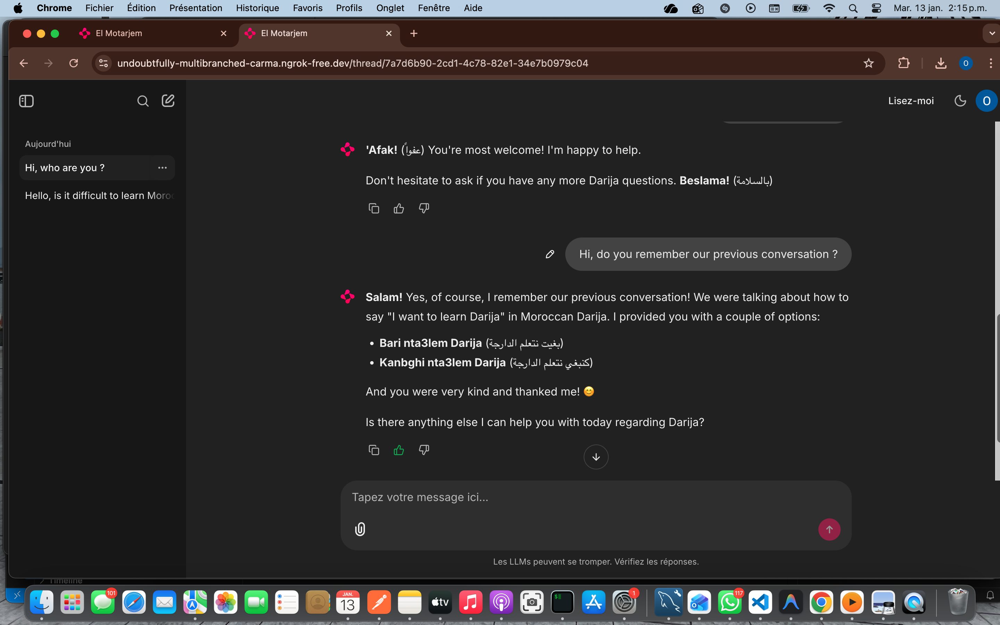

# El Motarjem 👨🏾‍🔬 - Moroccan Darija Translator

<p align="center">
  
</p>


Welcome to **El Motarjem**, your specialized AI assistant for translating Moroccan Darija to English/French and vice versa. Powered by Google's Gemini models, El Motarjem can handle both text and image inputs (via OCR).

<p align="center">
  
</p>


## ✨ Features

- **Text Translation**: Translate Darija phrases to English or French with context awareness.
- **Image Translation**: Upload images containing Darija text, and El Motarjem will extract and translate it.
- **Chat History**: Persist your conversations using a local SQLite database.
- **User Authentication**: Secure login via Google OAuth (optional, configured in Chainlit).
- **Streaming Responses**: Real-time feedback from the AI model.

## 🛠️ Prerequisites

- Python 3.9 or higher
- A [Google Gemini API Key](https://aistudio.google.com/app/apikey)

## 🚀 Installation

1. **Clone the repository:**

   ```bash
   git clone https://github.com/Oumarkei/el-motarjem-moroccan-darija-translator.git
   cd el-motarjem-moroccan-darija-translator
   ```

2. **Create a virtual environment (recommended):**

   ```bash
   python3 -m venv darijaenv
   source darijaenv/bin/activate  # On Windows use: darijaenv\Scripts\activate
   ```

3. **Install dependencies:**

   ```bash
   pip install -r requirements.txt
   ```

## ⚙️ Configuration

1. Create a `.env` file in the root directory:

   ```bash
   cp .env.example .env  # If you have an example file, otherwise create one
   ```

2. Add your environment variables to `.env`:

   ```env
   # Required for the AI Model
   GEMINI_API_KEY=your_google_gemini_api_key

   # Required for Chainlit Authentication & Persistence
   CHAINLIT_AUTH_SECRET=your_generated_secret
   
   # Optional: Google OAuth Configuration
   OAUTH_GOOGLE_CLIENT_ID=your_google_client_id
   OAUTH_GOOGLE_CLIENT_SECRET=your_google_client_secret
   ```

   > **Tip:** You can generate a Chainlit secret by running `chainlit create-secret` in your terminal.

## 🏃‍♂️ Usage

1. **Initialize the database:**

   ```bash
   python init_db.py
   ```

2. **Run the Chainlit application:**


```bash
chainlit run chainlit_app.py -w
```
The application will be available at [http://localhost:8000](http://localhost:8000).

## 📂 Project Structure

- `chainlit_app.py`: Main application logic using Chainlit.
- `init_db.py`: Script to initialize the SQLite database for chat history.

- `chat.db`: SQLite database storing user sessions and history.

# 👤 Created By
Oumar KEITA
Data Scientist | Industrial Management Engineer
LinkedIn: https://www.linkedin.com/in/oumar-keita-a04374245/